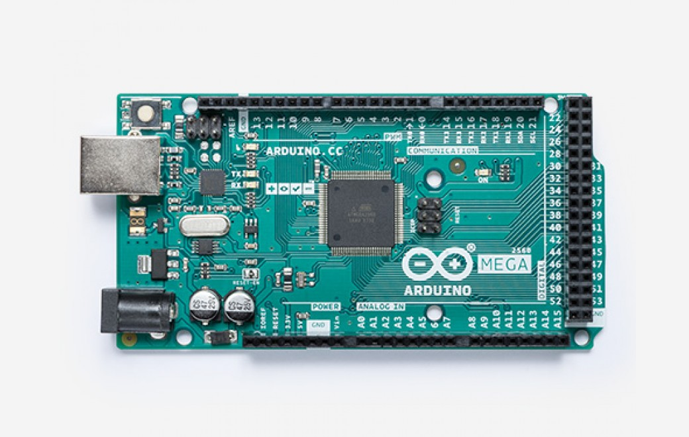

# Arduino MEGA 2560

:warning: **WARNING**: This board has 5V I/O Pins.  Connecting 3.3V-only sensors will result in damaging the sensor.  Use a voltage translator to step the I/O voltage down to 3.3V.  Refer to the sensor's datasheet for the safe I/O voltage range.

The [Arduino Mega 2560](https://store.arduino.cc/usa/mega-2560-r3) is similar to the Arduino Uno but has many more I/O pins and an upgraded processor.

### Pinout

*[Arduino Mega 2560 Amperka Viki](http://wiki.amperka.ru/_media/%D0%BF%D1%80%D0%BE%D0%B4%D1%83%D0%BA%D1%82%D1%8B:arduino-mega-2560:arduino-mega-2560_pinout.png)*

### Links

* [Schematic](https://content.arduino.cc/assets/MEGA2560_Rev3e_sch.pdf)
* [ATmega2560 Datasheet](http://ww1.microchip.com/downloads/en/DeviceDoc/Atmel-2549-8-bit-AVR-Microcontroller-ATmega640-1280-1281-2560-2561_datasheet.pdf)
