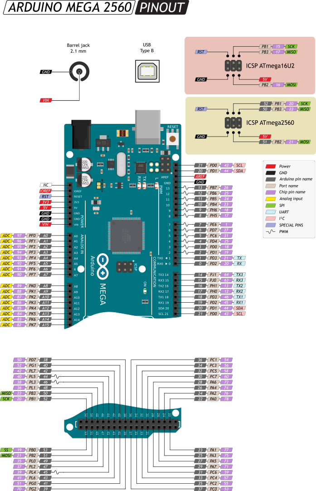

# Arduino Examples

## Example Projects

## Board Pinouts & Schematics

### Arduino UNO

:warning: **WARNING**: This board has 5V I/O Pins.  Connecting 3.3V-only sensors will result in damaging the sensor.  Use a voltage translator to step the I/O voltage down to 3.3V.  Refer to the sensor's datasheet for the safe I/O voltage range.

The [Arduino Uno](https://store.arduino.cc/usa/arduino-uno-rev3) is a good inexpensive beginners board for simple projects.  The hardware is open source so there are many clones available or you can even build your own Uno from components on a breadboard [[link](https://www.instructables.com/id/How-to-Build-an-Arduino-Uno-on-a-BreadBoard/)].

[**think\[box\]**]() has Arduino Uno boards available for purchase. See a staff member at the 3rd floor front desk.

#### Pinout

*"Pinout of ARDUINO Board and ATMega328PU" by [pighixxx](www.pighixxx.com) is licensed under [CC BY-SA 4.0](https://creativecommons.org/licenses/by-sa/4.0)*

#### Links

* [**Getting Started Guide**](https://www.arduino.cc/en/Guide/ArduinoUno)
* [Schematic](https://www.arduino.cc/en/uploads/Main/Arduino_Uno_Rev3-schematic.pdf)

### Arduino MEGA

:warning: **WARNING**: This board has 5V I/O Pins.  Connecting 3.3V-only sensors will result in damaging the sensor.  Use a voltage translator to step the I/O voltage down to 3.3V.  Refer to the sensor's datasheet for the safe I/O voltage range.

The [Arduino Mega 2560](https://store.arduino.cc/usa/mega-2560-r3) is similar to the Arduino Uno but has many more I/O pins and an upgraded processor.

#### Pinout

*[Arduino Mega 2560 Amperka Viki](http://wiki.amperka.ru/_media/%D0%BF%D1%80%D0%BE%D0%B4%D1%83%D0%BA%D1%82%D1%8B:arduino-mega-2560:arduino-mega-2560_pinout.png)*

#### Links

* [Schematic](https://content.arduino.cc/assets/MEGA2560_Rev3e_sch.pdf)
* 

### Adafruit Feather

#### Links

* [Adafruit Feather nRF52840 Express](https://www.adafruit.com/product/4062)
	* [Pinout](https://learn.adafruit.com/introducing-the-adafruit-nrf52840-feather/pinouts)
	* [Schematic](https://learn.adafruit.com/introducing-the-adafruit-nrf52840-feather/downloads)

### Adafruit Trinket

### Teensy

## Links to Additional Information

