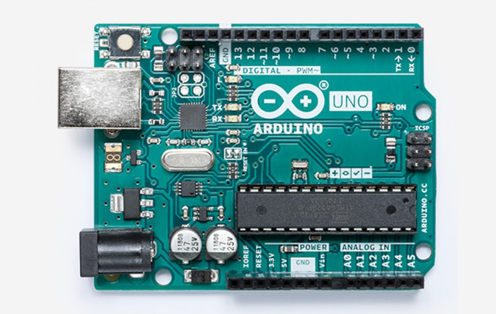

# Development Boards

ℹ️ This page provides a list of commonly used development boards with links to board information, guides and examples.

## Selector Table (Software)

The following table provides a quick reference to help you decide which of these boards best fit your project based on software concerns (i.e. IDE, Programming Language, Operating System)

| Board Family     | IDE Support | Programming Language | Operating System |
|------------------|:-----------:|:--------------------:|:----:|
| Arduino          | Arduino IDE | C/C++ | None (Super Loop) |
| Adafruit Feather | Arduino IDE | C/C++ | None (Super Loop) |
| Adafruit Trinket | Arduino IDE, CircuitPython | C/C++, Python | None (Super Loop), MicroPython |
| Teensy           | Arduino IDE | C/C++ | None (Super Loop) |
| ESP32            | Arduino IDE | C/C++ | FreeRTOS |
| Raspberry Pi     | Various  | C/C++, Python, Others | Raspian (Linux) |

## Selector Table (Hardware)

The following table provides a quick reference to help you decide which of these boards best fits your project based on hardware specifications.

| Board | Cost | CPU | Speed | GPIO | PWM | SPI | UART| Analog | Network |
|-------|:----:|:---:|:-----:|:----:|:---:|:---:|:---:|:------:|:-------:|
| [Arduino Uno](#arduino-uno) | ~$15 | ATmega328P | 16 MHz | 14 | 6 | 1 | 1 | 6 | None |
| [Arduino Mega](#arduino-mega) | ~$14 | ATmega2560 | 16 MHz | 54 | 15 | 1 | 4 | 16 | None |
| [Adafruit Trinket M0](#adafruit-trinket) | $9 | ATSAMD21E18 Cortex M0+ | 48 MHz | 5 | 2 | 1* | 1* | 3 | None |
| [Adafruit Feather M4 Express](#adafruit-feather) | $23 | ATSAMD51J19 Cortex M4 | 120 MHz | 21 | 16 | 6\* | 6\* | 6 | None |
| ESP 32 MINI32-v1 | ~$12 | Xtensa LX6 Dual-Core | 80-240 MHz | 32 | 12 | 4 | 3 | 18 | IEEE 802.11 b/g/n, BLE v4.2 |
| Teensy 3.6 | $30 | MK66FX1M0VMD18 Cortex M4 | 180 MHz | 62 | 22 | 3 | 6 | 25 | None |
| Raspberry Pi Zero-W | $5 | BCM2835 ARM11 | 1 GHz | 17 | 2 | 1 | 1 | 0 | 802.11 b/g/n, BLE v4.1 |
| Raspberry Pi 3B+ | $35 | BCM2837B0 Cortex A53 Quad-Core | 1.4 GHz | 17 | 2 | 1 | 1 | 0 | 10/100/1000base-T, 802.11 b/g/n, BLE v4.1 |

**\*** Shared SPI and UART pins

## Sensor Kits

There are a number of sensor kits on the market that provide many different types of sensors.  These kits are a good starting point for experimenting.

* [ELEGOO 37-in-1 Sensor Module Kit V1.0](https://www.elegoo.com/product/elegoo-37-in-1-sensor-module-kit/)

Before deciding on a sensor board, pick which development board you'll be using then look for an add-on board made for that platform.  Chances are there will be a board that will directly plug on to the board you're using.  If not, most of the sensor boards available are prototype board friendly so you'll have to do a little wiring to get things connected up.

## Arduino Uno

Many starter kits exist that have an Arduino Uno board with a set of

## Arduino Mega

* [ATmega2560 Datasheet](http://ww1.microchip.com/downloads/en/DeviceDoc/Atmel-2549-8-bit-AVR-Microcontroller-ATmega640-1280-1281-2560-2561_datasheet.pdf)

## Adafruit Trinket

The [Adafruit Trinket](https://www.adafruit.com/category/261) is a line of small footprint boards, tailored for wearable applications.  The newest models have an ARM Cortex M0 32-bit processor they can run CircuitPython.

* [Adafruit Trinket M0](https://www.adafruit.com/product/3500)

## Adafruit Feather

[Adafruit Feather](https://www.adafruit.com/category/943)

#### Feather [Boards](https://www.adafruit.com/category/835)
* [Adafruit Feather 32u4 Adalogger](https://www.adafruit.com/product/2795)
* [Adafruit Feather M4 Express](https://www.adafruit.com/product/3857)
* [Adafruit Feather nRF52840 Express](https://www.adafruit.com/product/4062)

#### FeatherWing [Add-on Boards](https://www.adafruit.com/category/814)

* [DC Motor + Stepper FeatherWing](https://www.adafruit.com/product/2927)
* [AirLift FeatherWing](https://www.adafruit.com/product/4264) (ESP32 Wifi Co-Processor)
* [NeoPixel FeatherWing](https://www.adafruit.com/product/2945)
* 

## ESP32

The ESP32 

## Teensy

The [Teensy](https://www.pjrc.com/teensy/) ....

* [Teensy 3.6](https://www.pjrc.com/store/teensy36.html)
* [Teensy 4.0](https://www.pjrc.com/store/teensy40.html)

## Raspberry Pi

